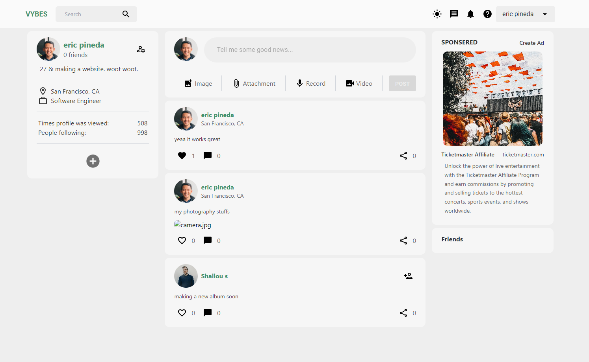

# vybes

## Description
- Modular social media website used to post, share, and chat about electronic music.
- Website: [vybes.onrender.com](https://vybes.onrender.com)
- Important: 
    - Currently, backend server is hosted on Render.com and by default sleeps after 10 minutes of inactivity.
    - To breifly mitigate this, please visit [vybes-backend.onrender.com](https://vybes-backend.onrender.com) for a brief few seconds to allow the server to wake. 
    - Planning to host backend on serverless website in the future.

## Functionalities
- Customized dark mode implemented with Tailwind class stragtery
- Identity Management served with JWT authentication.
- Ability to post messages and multi-media content on global feed
- Realtime chat with friended users 

## Techonologies
- Backend API: [Node](https://nodejs.org/en)
- Frontend Library: [React](https://tailwindcss.com/)
- Frontend Framework: [TailwindCSS](https://tailwindcss.com/)
- Database Host: [MongoDB](https://www.mongodb.com/)
- Database ODM: [Mongoose](https://mongoosejs.com/docs/)
- Cloud Storage: [Cloudinary](https://cloudinary.com/)
- Access Management: [Jwt](https://jwt.io/) 
- Global State Management: [Redux-Toolkit](https://redux-toolkit.js.org/)
- Hosting Server: [Render](https://render.com/)
